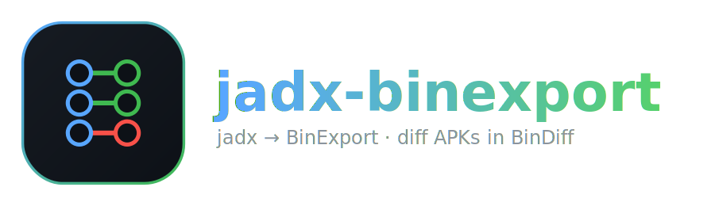

<p align="center">
  
</p>

# jadx-binexport — jadx → BinExport 플러그인

[English README](README.md)

[jadx](https://github.com/skylot/jadx)의 분석 결과(클래스, 메서드, 제어 흐름 그래프,
콜 그래프)를 [BinDiff](https://www.zynamics.com/bindiff.html)가 사용하는 **BinExport2**
protobuf 포맷으로 내보내는 jadx 플러그인이다.

즉, IDA Pro / Ghidra / Binary Ninja로 뽑은 네이티브 바이너리를 BinDiff에서 비교하듯이,
**두 APK의 Dalvik 바이트코드를 BinDiff에서 diff하고 시각화**할 수 있다.

## 왜 만들었나

BinDiff는 함수를 구조적으로 매칭한다(콜 그래프 + 함수별 CFG + 명령어 특징). 그래서
아키텍처에 크게 얽매이지 않는다. 실제로 BinExport2 포맷 자체가 DEX를 염두에 두고
설계되어 있다 — `kDex` 아키텍처, Java 클래스를 뜻하는 `Module` 메시지, `Vertex.module_index`가
이미 존재한다. 한편 jadx는 BinDiff가 필요로 하는 것(메서드, 기본 블록, 지배자 정보, 호출 참조)을
이미 다 계산하고, 안드로이드/Dalvik 이해도·이름 복원·multidex 처리까지 강하다. 이 플러그인은
그 사이를 잇는 접착제로, jadx 모델을 `.BinExport`로 직렬화한다.

## 매핑 방식

| jadx | BinExport2 |
| --- | --- |
| `ClassNode` | `Module` (클래스별, `Vertex.module_index`로 참조) |
| `MethodNode` | `CallGraph.Vertex` (주소 오름차순 정렬) |
| `invoke`(인라인/래핑 포함) | `CallGraph.Edge` + `Instruction.call_target` |
| `BlockNode` | `BasicBlock` (전역 명령어 인덱스 범위), enter 블록을 맨 앞에 배치 |
| `BlockNode.getSuccessors()` | `FlowGraph.Edge` (IF true/false는 `IfNode`에서 판정, 지배자 기반 back edge) |
| `InsnNode` | `Instruction` + `Operand`/`Expression` + 정규 `raw_bytes` |
| 정렬된 메서드 인덱스 | 합성 `uint64` 주소 `(idx+1)<<20 + seq` |

Dalvik에는 선형 주소 공간이 없으므로, 각 메서드는 메서드 시그니처의 결정적 정렬에서
유도한 안정적인 합성 기준 주소를 받는다. 주소는 *하나의 파일 안에서만* 고유하고
일관되면 되고(BinDiff는 구조로 매칭한다), 같은 입력을 다시 빌드해도 동일하게 유지된다.

## 요구 사항

- jadx **1.5.6** (플러그인 API). jadx가 지원하는 아무 JRE(Java 11+)에서 동작한다.
- BinDiff (내보낸 파일을 비교하는 쪽).
- 빌드용 JDK (11+). Gradle wrapper 포함되어 있다.

## 빌드

```bash
./gradlew build
# -> build/libs/jadx-binexport-0.1.0.jar
```

산출물 jar은 자체 완결형이다(protobuf 런타임을 shade + relocate 처리).

## jadx에 설치

```bash
jadx plugins --install-jar build/libs/jadx-binexport-0.1.0.jar
jadx plugins --list        # "jadx-binexport"가 보이면 성공
```

jadx-gui에서는 *Preferences → Plugins → Install plugin (jar)*.

## 사용법

### CLI (자동)

입력이 로드되면 자동으로 내보낸다:

```bash
# 비교할 두 버전을 반드시 "같은 jadx 버전"으로 각각 내보낸다.
jadx -d out_v1 app-v1.apk        # -> out_v1/app-v1.BinExport
jadx -d out_v2 app-v2.apk        # -> out_v2/app-v2.BinExport
```

출력 경로를 직접 지정하려면 (플러그인 옵션 — `jadx plugins`와 GUI 설정에서도 확인 가능):

```bash
jadx -d out app.apk -Pjadx-binexport.output=/path/app.BinExport
# 또는 디렉터리:   -Pjadx-binexport.outdir=/some/dir
# 기존 시스템 프로퍼티도 계속 동작 (jadx에는 -J 전달이 없으므로 환경변수 사용):
#   JADX_OPTS="-Dbinexport.output=/path/app.BinExport" jadx -d out app.apk
```

출력 경로 결정 순서(먼저 매치되는 것): `output` 옵션 → `outdir` 옵션
→ jadx 출력 디렉터리, 파일명은 `<입력-베이스명>.BinExport`. 같은 파일명의 두 버전을
export할 때는 경로를 다르게 지정하세요 — 기존 파일은 (로그 경고와 함께) 덮어씁니다.

### GUI (수동)

APK를 연 뒤 **Plugins → Export to BinExport (.BinExport)** 클릭. 진행률 바로 export가
얼마나 진행됐는지 보여주고(큰 앱은 1~2분 걸린다) **취소**할 수 있으며, 끝나면 저장된
파일 경로를 다이얼로그로 알려준다.

### BinDiff에서 비교

BinDiff → **New Diff** → 두 `.BinExport` 파일 선택 → 실행. 매칭/비매칭 함수와
콜 그래프·플로우 그래프 시각화를 볼 수 있다. CLI로도 가능하다:

```bash
bindiff app-v1.BinExport app-v2.BinExport --output_dir results/
```

### jadx 안에서 바로 디핑하고 탐색 (IDA BinDiff 플러그인처럼)

`bindiff`를 직접 돌릴 필요 없다. diff는 항상 `.BinExport` 두 개로 만들어지는데,
jadx엔 이미 한쪽(열린 앱)이 있으니 **나머지 한쪽만 열면** 된다. 앱 **A**를 jadx-gui에
연 상태에서, 앱 **B**는 이미 `B.BinExport`로 내보내 뒀다면:

**Plugins → Open BinExport (.BinExport)…** → `B.BinExport` 선택.

플러그인이 A를 export하고, A vs B로 `bindiff`를 돌린 뒤, 결과를 한 번에 연다. 진행
단계(export → BinDiff 실행 → 결과 로딩)를 진행률 바로 보여주며 언제든 **취소**할 수
있다 — 실행 중 취소하면 export를 멈추거나 `bindiff` 프로세스를 종료한다. 열린
앱(A)에 속한 매칭 함수들이 테이블로 뜨고, 유사도 순(바뀐 함수부터)으로 정렬되어
빨강→초록으로 색칠된다. **행을 더블클릭(또는 Enter)하면 그 메서드가 jadx에서 열린다.**
필터 상자로 목록을 좁힐 수 있다.

`bindiff` 실행 파일이 필요하다. `PATH`에 없으면 `jadx-binexport.bindiff` 플러그인
옵션에 전체 경로를 지정하면 된다.

매칭은 이름으로 연결되므로(각 메서드의 전체 시그니처를 `mangled_name`으로 기록) 주소가
합성값이어도 네비게이션이 동작한다 — 단, export를 만든 것과 같은 앱·같은 jadx 버전
세션에서 디핑해야 한다.

## 주의

- **양쪽을 반드시 같은 jadx 버전으로 내보낸다.** jadx는 raw smali가 아니라 정규화된
  IR를 내보내고 많은 `invoke`를 operand 트리로 접는다. 니모닉 집합과 폴딩 방식이 jadx
  버전마다 달라, 버전을 섞으면 매칭 품질이 떨어진다. 파일의 `architecture_name`에
  jadx 버전이 기록되므로(`dalvik-jadx-<버전>`) 버전 불일치를 BinDiff에서 눈으로 확인할 수 있다.
- **Dalvik(DEX)만 지원.** 네이티브 `lib/*.so`는 ELF/ARM이라 기존 BinExport의 ARM/AArch64
  익스포터로 이미 diff된다 — 이 플러그인 범위 밖이다.

## 상태

**엔드투엔드 검증 완료** (BinDiff 8):

- `./gradlew build` + 통합 테스트(실제 jadx 모델 → BinExport2 재파싱, 불변식 검사) 통과.
- jadx `dex-input` 실제 APK 경로: 1.3 MB APK를 함수 13,226개 / 명령어 90,106개로
  내보냈고 모든 구조 불변식이 성립.
- BinDiff 인제스트: 산출 파일이 실제로 로드·diff됨(동일 파일 self-match 13,226/13,226),
  난독화(이름 변경)된 빌드에서도 매칭 유지.
- 결정성: 같은 입력의 두 export는 (타임스탬프 제외) 바이트 단위로 동일.

실제 APK 경로를 도는 옵트인 스모크 테스트:

```bash
./gradlew test -Pbinexport.smoke.apk=/path/to/app.apk
```

## 개발

아키텍처 노트, 어렵게 얻은 jadx 함정(특히: `cls.decompile()`은 CFG를 언로드해 없애버린다 →
`forceProcess`를 써야 한다), BinExport2 포맷 규칙, 백로그는 [CLAUDE.md](CLAUDE.md) 참고.

```bash
./gradlew test        # 통합 테스트만 실행
```

## 라이선스

벤더링된 `src/main/proto/binexport2.proto`는 Apache-2.0 (© Google LLC)이며,
[google/binexport](https://github.com/google/binexport)에서 그대로 가져왔다.
